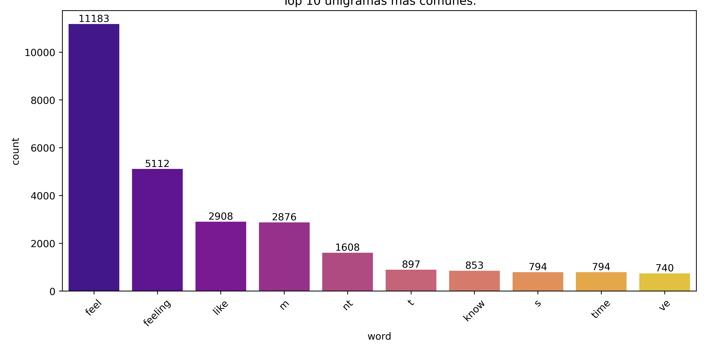
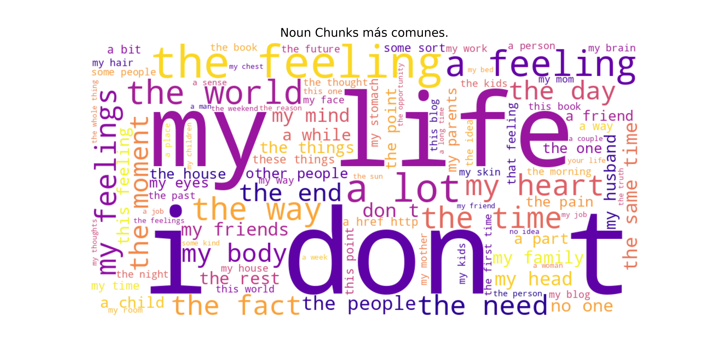
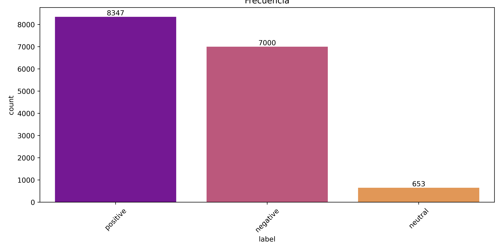

# Dimensiones y tipos de datos
- Número de filas: **16000 entries**
- Número de columnas: **2 [text, label]**

# Tipos de datos
| Columna | Tipo | Nulos |
|---------|------|--------|
| text    | str  | 0      |
| lable  | list  | 0      |

# Renglon mínimo de tokens
- Longitud mínima de tokens: **11** tokens.
> `earth crake`

# Renglon máximo de tokens
- Longitud máxima de tokens: **542** tokens.
> `i feel in my bones like nobody cares if im here nobody cares if im gone here i am again saying im feeling so lonely people either say its ok to be alone or just go home it kills me and i dont know why it doesnt mean i dont try i try and try but people just treat me like im a ghost`

# Top 10 Unigramas más comunes.

# Top 10 Noun Chunks más comunes.

# Wordcloud

# Vader Score

